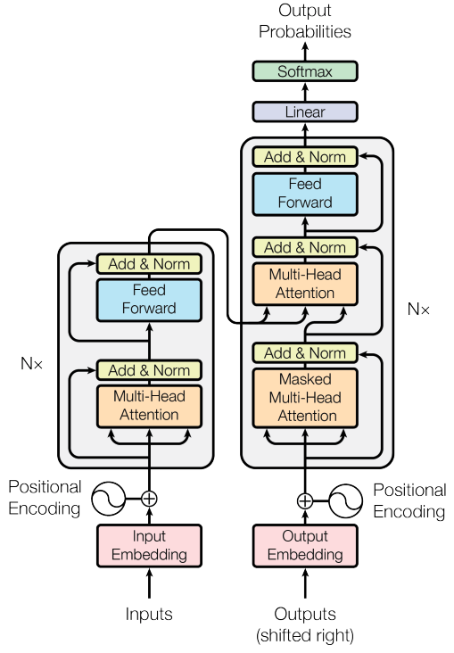

# 🤗 Time series prediction based on Transformers

This repository contains a code fulfillment of time series prediction using NLP model - Tansformers. More specifically, I use stock price data from [Nasdaq-traded historical dataset](https://www.kaggle.com/datasets/jacksoncrow/stock-market-dataset?datasetId=541298) to train the model. So you can call this time series prediction task as stock price prediction🤥. \
The aim of this repo is to show how to build a Transformer model for structural time squence data and provide a complete baseline for this task.

# 📊 Dataset

The dataset used in this task is [Nasdaq-traded historical dataset](https://www.kaggle.com/datasets/jacksoncrow/stock-market-dataset?datasetId=541298). In this dataset, there are tow directories named `etfs` and `stocks` respectively. Within each of both directories, there are thousands of `csv` format files representing different companies stock or etf data. 

In each file, there are several features:

- Date - specifies trading date
- Open - opening price
- High - maximum price during the day
- Low - minimum price during the day
- Close - close price adjusted for splits
- Adj Close - adjusted close price adjusted for both dividends and splits.
- Volume - the number of shares that changed hands during a given day

# 🧠 Model

According to this [article](https://arxiv.org/abs/1706.03762), Transformer is consists of Encoder and Decoder. 

# 👀 How I do?

- `data_utils.py`: for each file data, I calculate the MA(Moving Average) and rate of return. Meanwhile, I use sliding window to extract model input and output.
- `model.py`: Transformers model always needs two inputs and one outputs data during training step. Encoder input and Decoder input are two inputs, Decoder output is the output. I don't use positional embedding insead of Time embedding according to this [article](https://arxiv.org/abs/1907.05321).
- `train.py`: train the model.
